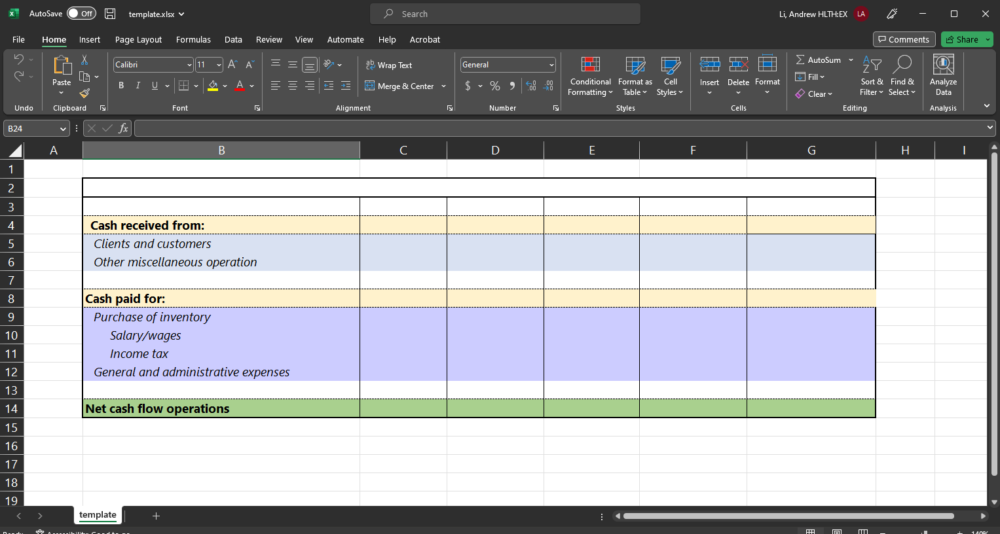
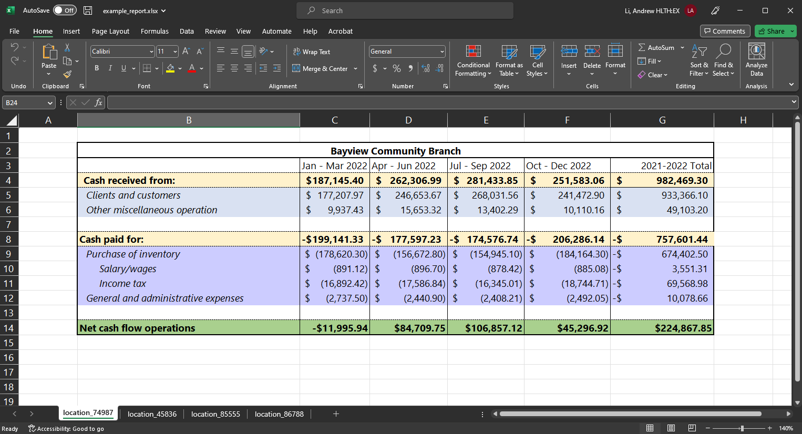
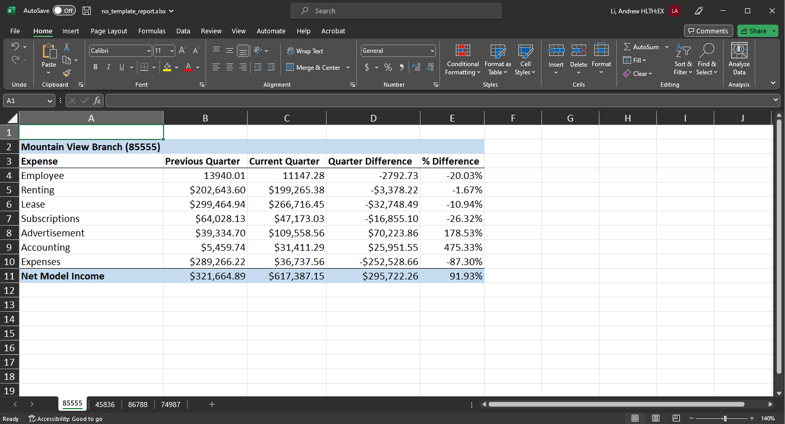

# Parameterized Excel reports 

The `{openxlsx}` library lets you wield a lot of control over the content and format of Excel worksheets. This repo demonstrates how to generate client-ready Excel reports that doesn't need any manual tweaking afterwards. 

Most clients prefer excel reports. This repo demonstrates how you to do all the number crunching in R and then create an Excel worksheet. Inspired by [Parameterized reporting](https://bookdown.org/yihui/rmarkdown/parameterized-reports.html) in RMarkdown and Albert Rapp's [tweet](https://twitter.com/rappa753/status/1652825182392950786?s=20), this workflow allows you to work in R and communicate with MS Office. That way, everyone can use your work.

**Note:** The code uses randomly generated column and branch location names. The data used in this script is randomly generated and does not represent any real financial data. It is intended for demonstration purposes only.

## Installation

To run this script, you will need to have R installed on your computer along with the required packages openxlsx and dplyr. You can install the required packages using the following code:
 
 ```
 install.packages("openxlsx")
 install.packages("dplyr")
 ```

## With a template

`generate_excel_report.R` demonstrates how to create an Excel workbook from a template. This can be useful when the report requires a lot of customization before it can be client-ready. `template.xlsx` contains a blank table and cells with customization/formulas. Using a template allows you to create more elaborate and complex contents and formats with no additional code. 



<br>



## Without a template

`no_template_report.R` demonstrates how to create an Excel workbook from the ground up. All the content and style seen in the final product needs to be added in the R file. 

